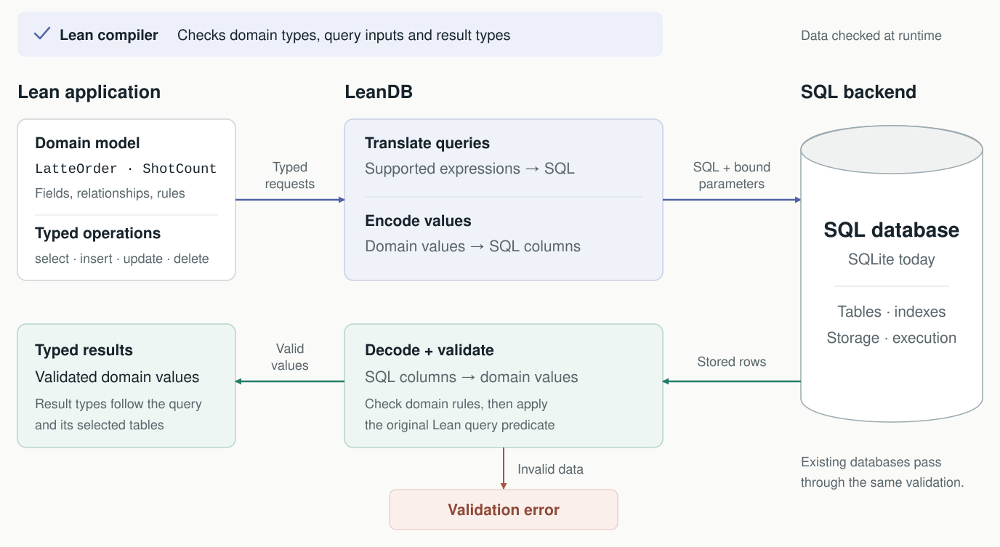

# LeanDB

**Strongly typed SQL in Lean 4.**

Define your data and queries in Lean. Store the data in SQLite.

- Types describe your data and its rules.
- The compiler checks query inputs and result types.
- Reads validate stored values.
- Schema changes produce migration plans.



## Setup

Install [elan](https://github.com/leanprover/elan), the Lean toolchain manager.
Then build LeanDB:

```bash
git clone https://github.com/theoriclabs/LeanDB.git leandb
cd leandb
lake build leandb
```

SQLite is bundled. The first build takes a few minutes.
Start with the [tickets example](examples/tickets/README.md).

## Typed data

Define tables as Lean structures. Use a codec to validate custom fields.
This codec rejects empty titles when reading SQLite rows or JSON:

```lean
import LeanDb

open LeanDb

structure Title where
  raw : String
  deriving Repr, DecidableEq, Ord

def Title.make (s : String) : Except String Title :=
  let title := s.trimAscii.toString
  if title.isEmpty then .error "title must be nonempty" else .ok ⟨title⟩

instance : ColCodec Title := ColCodec.via (·.raw) Title.make

inductive Status where
  | backlog | inProgress | done
  deriving Repr, DecidableEq, Ord, LeanDb.ClosedEnum

structure User where
  name : String
  deriving Repr, LeanDb.Entity

structure Ticket where
  title    : Title
  status   : Status := .backlog
  reporter : Ref User
  deriving Repr, LeanDb.Entity
```

`Ref User` is a typed foreign key.
`deriving LeanDb.Entity` generates the table schema and row codecs.
Defaults and foreign keys come from the same declarations.

## Typed queries

The table list determines the query's input and result types.
This query joins tickets with their reporters:

```lean
def activeTickets : DbM (Array (Stored Ticket × Stored User)) :=
  select [Ticket, User]
    (fun (ticket, user) =>
      ticket.val.reporter == user.ref && ticket.val.status != .done)
    (.key fun (ticket, _) => ticket.val.title)

-- A predicate for the wrong table does not compile.
#check_failure
  select [User] (fun (ticket : Stored Ticket) => ticket.val.status == .done)
```

LeanDB translates supported expressions into SQL.
It always applies the original Lean predicate to the decoded rows.
Expressions it cannot translate run in Lean.
Use `log` to see the generated query plans.

## Schema migrations

Edit a type to change the schema. For example, add an optional assignee:

```diff
 structure Ticket where
   title    : Title
   status   : Status := .backlog
   reporter : Ref User
+  assignee : Option (Ref User)
   deriving Repr, LeanDb.Entity
```

Rebuild your base. Run `migrate status` to inspect the plan.
Run `migrate apply` to apply it.

Automatic migrations need an `Option` type or a default for new columns.
Migrations run in transactions and create backups by default.
Dropping tables or columns requires `--allow-destructive`.

Use `migrate freeze` to version the schema.
Typed row transformations handle changes that need custom conversion.
See the [legacy example](examples/legacy/README.md) for a full migration.

## Create a base

A *base* is a Lean package with tables, queries, and a CLI.
An *instance* is the SQLite file it uses.

From the repository root:

```bash
./.lake/build/bin/leandb new notes --out ../notes --leandb-path "$PWD"
cd ../notes
lake build
./.lake/build/bin/notes seed
./.lake/build/bin/notes query drafts
```

The generated package includes types, queries, and tests.
Use `--db <path>` or `LEANDB_DB` to choose an instance.

## Import a SQLite database

From the repository root, generate a base from an existing database:

```bash
./.lake/build/bin/leandb import-sqlite inventory.db \
  --name inventory --out ../inventory --require-path "$PWD"
```

LeanDB derives types from the stored schema.
You can then add stronger validation to those types.
Unsupported features are listed in the generated `IMPORT.md`.
See the [legacy example](examples/legacy/README.md) to adopt and migrate a file.

## The CLI every base gets

Run `<base> help` for table names, queries, and arguments.
Commands return JSON. Quote JSON arguments in your shell.

| Command | Purpose |
|---|---|
| `schema` | Show the derived schema. |
| `version` | Check whether code and database schemas match. |
| `insert <table> <json>` | Validate and insert a row. |
| `get <table> <id>` | Read a row. |
| `update <table> <id> <json>` | Validate and apply a partial update. |
| `delete <table> <id>` | Delete a row. |
| `rows <table> [--eq col=value] [--limit n]` | List or filter rows. |
| `query <name> [args…]` | Run a registered query. |
| `seed` | Load the base's sample data. |
| `migrate status` / `migrate apply` | Inspect or apply schema changes. |
| `migrate freeze` | Save a schema version. |
| `migrate history` / `migrate rollback` | Show migrations or restore the last migration backup. |
| `backup` / `restore <file>` | Save or restore a database copy. |
| `log [n]` | Show recent query plans and outcomes. |
| `serve` | Serve JSON requests over standard input and output. |
| `serve --mcp` | Expose tables and queries as MCP tools. |
| `serve --http <port>` | Serve the same API over HTTP. |

Exit codes: `0` for success, `2` for database errors, `3` for usage errors,
and `4` for schema or migration history mismatches.

## Examples

| Example | Shows |
|---|---|
| [tickets](examples/tickets/README.md) | An issue tracker with typed references and joins. Start here. |
| [crm](examples/crm/README.md) | Queries across companies, contacts, and asks. |
| [shop](examples/shop/README.md) | Basket joins and inventory filtering. |
| [eats](examples/eats/README.md) | Menus, opening hours, and configurable offers. |
| [legacy](examples/legacy/README.md) | Importing SQLite data and writing typed migrations. |
| [dashboard](examples/dashboard/Main.lean) | Calling typed queries locally, over stdio, and over HTTP. |

## Development

Run the engine tests:

```bash
lake build leandb_tests
./.lake/build/bin/leandb_tests
```

See the [source](LeanDb/) and [design proposals](proposals/) for details.
